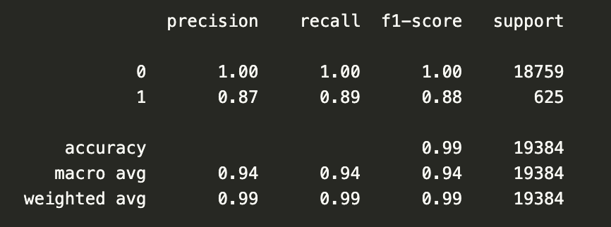
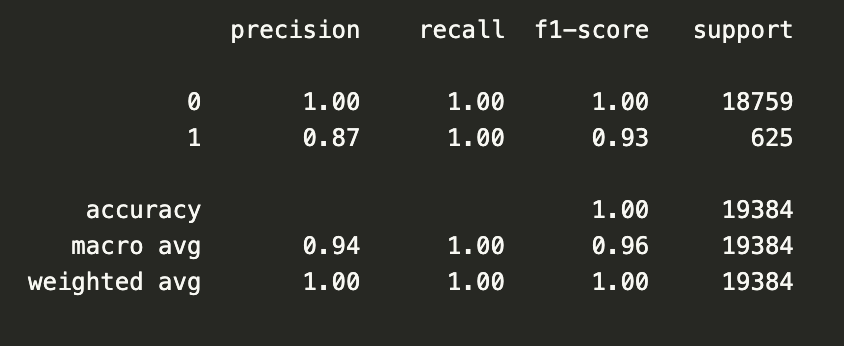

# credit-risk-classification
Module 20 Supervised Learning Challenge

By A.Narag May 17, 2023

This challenge uses various techniques to train and evaluate a model based on loan risk. A dataset of historical lending activity from a peer-to-peer lending services company is used to build a model that can identify the creditworthiness of borrowers.

### Split the Data into Training and Testing Sets
1. Created a Pandas DataFrame using the lending_data.csv data from the Resources folder.
2. Created the labels set (y) from the “loan_status” column, and then create the features (X) DataFrame from the remaining columns.

### Create a Logistic Regression Model
1. Fit a logistic regression model by using the training data (X_train and y_train).
2. Save the predictions for the testing data labels by using the testing feature data (X_test) and the fitted model.
3. Evaluate the model’s performance by doing the following:
    a. Calculate the accuracy score of the model.
    b. Generate a confusion matrix.
    c. Print the classification report.
4. Confirm how well does the logistic regression model predict both the 0 (healthy loan) and 1 (high-risk loan) labels

### __Credit Risk Analysis Report__
1. **Analysis Overview:** The purpose of this report is to build a model that can identify the creditworthiness of borrowers using a dataset of historical lending activity from a peer-to-peer lending services company. A Logistic Regression Model is used on both the original dataset and a resampled dataset using the RandomOverSampler module from the imbalanced-learn library. 

2. **Results:** 

    - Using the original data: 
        * Training Data Score: 0.9914878250103177
        * Testing Data Score: 0.9924164259182832
        * Balanced Accuracy Score: 0.9442676901753825
        * Accuracy Score: 0.9924164259182832
        * Confusion Matrix: 
            - True Negatives: 18679
            - False Positives:   80
            - False Negatives:   67
            - True Positives:   558
        * Classification Report 
            
    
    - Using the sampled data: 
        * Training Data Score: 0.9941016646031091
        * Testing Data Score: 0.9952022286421791
        * Balanced Accuracy Score: 0.9959744975744975
        * Accuracy Score: 0.9952022286421791
        * Confusion Matrix: 
            - True Negatives: 18668
            - False Positives:   91
            - False Negatives:    2
            - True Positives:   623
        * Classification Report
            

3. **Summary:** [Summarize the results from the machine learning model. Include your justification for recommending the model for use by the company. If you don’t recommend the model, justify your reasoning.]

    - When using the original data, the balanced accuracy score was 0.9442676901753825. This score is a measure of classification accuracy that takes into account class imbalance in the data, calculating the average of the true positive rate and true negative rate. A score of 1 means a perfect classification accuracy, while 0 represents random guessing; therefore, a higher score indicates better overall classification performance, considering both positive and negative classes. It is especially useful when there is an imbalance in the dataset, with a count of 75,036 '0' values (healthy loans) and only 2,500 '1' values (high-risk loans). Considering the imbalance, 0.944 is still high. 
    - When set against the balance accuracy score using the sampled data of 0.9959744975744975, the score increased, proving that the collected data can be used to build a model to effectively train and test the machine learning model to identify the creditworthiness of borrowers.  
    - Furthermore, the Confusion Matrix for both original and sampled data show high number of True Negatives and low number of False Negatives while also showing a low number of False Positives vs. higher number of True Positives. The percentage of incorrectly predicted negatives and positives is low compared to the higher instance of correct prediction. 
    - Lastly, the Accuracy rate on the Classification Report for both original and sampled data were very high, at 0.99 and 1.00, respectively.  The Recall, also known as sensitivity or true positive rate, measures how well the model identifies positive instances. In both reports, the recall for both classes '0' and '1' are high even with 0.88 for class '1' using the original data.  The sampled data showed a 1.00 rate for both '0' and '1' classes. 

I would recommend the model because the results suggest that the dataset and the corresponding machine learning model have performed well in terms of accuracy, precision, recall, and F1-score. The model has the ability to correctly classify instances in the dataset, achieving a high level of accuracy. This is certainly a positive indication for the dataset.

